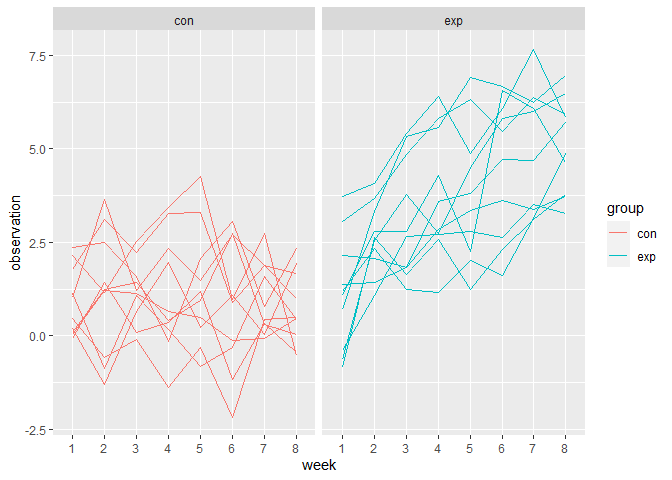
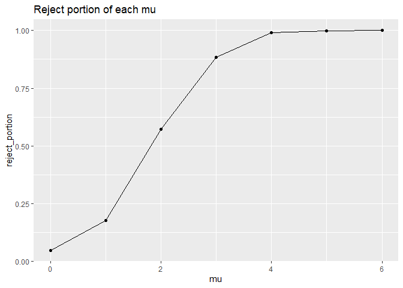
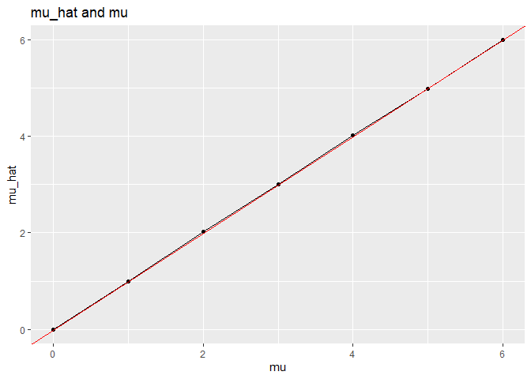
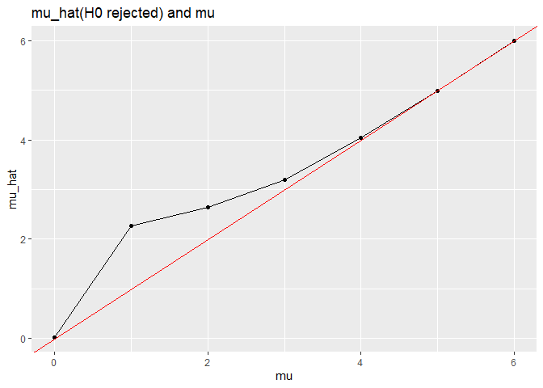

P8105_hw5
================
Hongzhu Ren
2023-11-15

``` r
library(tidyverse)
```

    ## ── Attaching core tidyverse packages ──────────────────────── tidyverse 2.0.0 ──
    ## ✔ dplyr     1.1.3     ✔ readr     2.1.4
    ## ✔ forcats   1.0.0     ✔ stringr   1.5.0
    ## ✔ ggplot2   3.4.3     ✔ tibble    3.2.1
    ## ✔ lubridate 1.9.2     ✔ tidyr     1.3.0
    ## ✔ purrr     1.0.2     
    ## ── Conflicts ────────────────────────────────────────── tidyverse_conflicts() ──
    ## ✖ dplyr::filter() masks stats::filter()
    ## ✖ dplyr::lag()    masks stats::lag()
    ## ℹ Use the conflicted package (<http://conflicted.r-lib.org/>) to force all conflicts to become errors

``` r
library(readr)
```

# Problem 1

``` r
## read data
data_url <- "https://raw.githubusercontent.com/washingtonpost/data-homicides/master/homicide-data.csv"
homicide <- read_csv(data_url, na = c("", "NA", "Unknown"))
```

    ## Rows: 52179 Columns: 12
    ## ── Column specification ────────────────────────────────────────────────────────
    ## Delimiter: ","
    ## chr (8): uid, victim_last, victim_first, victim_race, victim_sex, city, stat...
    ## dbl (4): reported_date, victim_age, lat, lon
    ## 
    ## ℹ Use `spec()` to retrieve the full column specification for this data.
    ## ℹ Specify the column types or set `show_col_types = FALSE` to quiet this message.

The raw data contains 52179 observations of 12 variables, containing
uid, reported_date, victim_last, victim_first, victim_race, victim_age,
victim_sex, city, state, lat, lon, disposition. Variables with prefix
“victim” described the characteristics of victim, `disposition`
describes the outcome of the case.

``` r
## add city_state variable
homicide_tidy <- homicide|>
  mutate(
    city_state = str_c(city,state,sep = ",")
  )|>
  filter(city_state != "Tulsa,AL") 
```

``` r
## get homicide unsolved in each city
homicide_unsolved <- homicide_tidy |>
  group_by(city_state)|>
  summarise(
    homicide = n(),
    unsolved = sum(disposition %in% c("Closed without arrest", "Open/No arrest"))
  )|>
  arrange(unsolved)
```

The city with lowest unsolved cases is Tampa,FL,the city with highest
unsolved cases is Chicago,IL

``` r
Bal_test <- prop.test(
  homicide_unsolved |>filter(city_state == "Baltimore,MD")|>pull(unsolved),
   homicide_unsolved |>filter(city_state == "Baltimore,MD")|>pull(homicide))

Bal_test |> broom::tidy()|>
  select(estimate,conf.low,conf.high)|>
  knitr::kable()
```

|  estimate |  conf.low | conf.high |
|----------:|----------:|----------:|
| 0.6455607 | 0.6275625 | 0.6631599 |

The outcome of prop.test is shown in the table above.

``` r
city_test <- homicide_unsolved |>
  mutate(
    prop_test = map2(unsolved,homicide, \(x,y) prop.test(x=x,n=y)),
    tidy_test = map(prop_test, broom::tidy)
  )|>
  unnest(tidy_test)|>
  select(city_state,estimate,conf.low,conf.high)|>
  mutate(city_state = fct_reorder(city_state,estimate))
```

``` r
city_test |>
  ggplot(aes(y=estimate,x=city_state))+
  geom_point()+
  geom_errorbar(aes(ymin = conf.low, ymax = conf.high)) + 
  theme(axis.text.x = element_text(angle = 90, hjust = 1))
```

<!-- -->

The plot suggests a widely ranged rate of unsolved homicides. Chicago
has a high rate with low CI, indicating this place is at high risk of
homicide.

# Problem 2

We first generate files names and form a initial data frame containg the
information of group and id.

``` r
## generate file names
file_names <- list.files(path = "./data")
file_path <- str_c("./data",file_names,sep = "/")

## generate group and id
group_id <- 
  tibble(
    group_id = str_remove(file_names,".csv")
  )
```

Read longitudinal data into the initial data frame with map function and
use pivot_longer to get longitudinal dataset for plotting.

``` r
## read longitudinal observations data
longitudinal <- mutate(separate(group_id, col = group_id,into = c("group","id"),sep = "_"))|>
  mutate(
    observation = map(file_path,read_csv)
    )|>
  unnest(observation)|> 
  pivot_longer(
    cols = starts_with("week"),
    names_prefix = "week_",
    names_to = "week",
    values_to = "observation" 
  )
```

    ## Rows: 1 Columns: 8
    ## ── Column specification ────────────────────────────────────────────────────────
    ## Delimiter: ","
    ## dbl (8): week_1, week_2, week_3, week_4, week_5, week_6, week_7, week_8
    ## 
    ## ℹ Use `spec()` to retrieve the full column specification for this data.
    ## ℹ Specify the column types or set `show_col_types = FALSE` to quiet this message.
    ## Rows: 1 Columns: 8
    ## ── Column specification ────────────────────────────────────────────────────────
    ## Delimiter: ","
    ## dbl (8): week_1, week_2, week_3, week_4, week_5, week_6, week_7, week_8
    ## 
    ## ℹ Use `spec()` to retrieve the full column specification for this data.
    ## ℹ Specify the column types or set `show_col_types = FALSE` to quiet this message.
    ## Rows: 1 Columns: 8
    ## ── Column specification ────────────────────────────────────────────────────────
    ## Delimiter: ","
    ## dbl (8): week_1, week_2, week_3, week_4, week_5, week_6, week_7, week_8
    ## 
    ## ℹ Use `spec()` to retrieve the full column specification for this data.
    ## ℹ Specify the column types or set `show_col_types = FALSE` to quiet this message.
    ## Rows: 1 Columns: 8
    ## ── Column specification ────────────────────────────────────────────────────────
    ## Delimiter: ","
    ## dbl (8): week_1, week_2, week_3, week_4, week_5, week_6, week_7, week_8
    ## 
    ## ℹ Use `spec()` to retrieve the full column specification for this data.
    ## ℹ Specify the column types or set `show_col_types = FALSE` to quiet this message.
    ## Rows: 1 Columns: 8
    ## ── Column specification ────────────────────────────────────────────────────────
    ## Delimiter: ","
    ## dbl (8): week_1, week_2, week_3, week_4, week_5, week_6, week_7, week_8
    ## 
    ## ℹ Use `spec()` to retrieve the full column specification for this data.
    ## ℹ Specify the column types or set `show_col_types = FALSE` to quiet this message.
    ## Rows: 1 Columns: 8
    ## ── Column specification ────────────────────────────────────────────────────────
    ## Delimiter: ","
    ## dbl (8): week_1, week_2, week_3, week_4, week_5, week_6, week_7, week_8
    ## 
    ## ℹ Use `spec()` to retrieve the full column specification for this data.
    ## ℹ Specify the column types or set `show_col_types = FALSE` to quiet this message.
    ## Rows: 1 Columns: 8
    ## ── Column specification ────────────────────────────────────────────────────────
    ## Delimiter: ","
    ## dbl (8): week_1, week_2, week_3, week_4, week_5, week_6, week_7, week_8
    ## 
    ## ℹ Use `spec()` to retrieve the full column specification for this data.
    ## ℹ Specify the column types or set `show_col_types = FALSE` to quiet this message.
    ## Rows: 1 Columns: 8
    ## ── Column specification ────────────────────────────────────────────────────────
    ## Delimiter: ","
    ## dbl (8): week_1, week_2, week_3, week_4, week_5, week_6, week_7, week_8
    ## 
    ## ℹ Use `spec()` to retrieve the full column specification for this data.
    ## ℹ Specify the column types or set `show_col_types = FALSE` to quiet this message.
    ## Rows: 1 Columns: 8
    ## ── Column specification ────────────────────────────────────────────────────────
    ## Delimiter: ","
    ## dbl (8): week_1, week_2, week_3, week_4, week_5, week_6, week_7, week_8
    ## 
    ## ℹ Use `spec()` to retrieve the full column specification for this data.
    ## ℹ Specify the column types or set `show_col_types = FALSE` to quiet this message.
    ## Rows: 1 Columns: 8
    ## ── Column specification ────────────────────────────────────────────────────────
    ## Delimiter: ","
    ## dbl (8): week_1, week_2, week_3, week_4, week_5, week_6, week_7, week_8
    ## 
    ## ℹ Use `spec()` to retrieve the full column specification for this data.
    ## ℹ Specify the column types or set `show_col_types = FALSE` to quiet this message.
    ## Rows: 1 Columns: 8
    ## ── Column specification ────────────────────────────────────────────────────────
    ## Delimiter: ","
    ## dbl (8): week_1, week_2, week_3, week_4, week_5, week_6, week_7, week_8
    ## 
    ## ℹ Use `spec()` to retrieve the full column specification for this data.
    ## ℹ Specify the column types or set `show_col_types = FALSE` to quiet this message.
    ## Rows: 1 Columns: 8
    ## ── Column specification ────────────────────────────────────────────────────────
    ## Delimiter: ","
    ## dbl (8): week_1, week_2, week_3, week_4, week_5, week_6, week_7, week_8
    ## 
    ## ℹ Use `spec()` to retrieve the full column specification for this data.
    ## ℹ Specify the column types or set `show_col_types = FALSE` to quiet this message.
    ## Rows: 1 Columns: 8
    ## ── Column specification ────────────────────────────────────────────────────────
    ## Delimiter: ","
    ## dbl (8): week_1, week_2, week_3, week_4, week_5, week_6, week_7, week_8
    ## 
    ## ℹ Use `spec()` to retrieve the full column specification for this data.
    ## ℹ Specify the column types or set `show_col_types = FALSE` to quiet this message.
    ## Rows: 1 Columns: 8
    ## ── Column specification ────────────────────────────────────────────────────────
    ## Delimiter: ","
    ## dbl (8): week_1, week_2, week_3, week_4, week_5, week_6, week_7, week_8
    ## 
    ## ℹ Use `spec()` to retrieve the full column specification for this data.
    ## ℹ Specify the column types or set `show_col_types = FALSE` to quiet this message.
    ## Rows: 1 Columns: 8
    ## ── Column specification ────────────────────────────────────────────────────────
    ## Delimiter: ","
    ## dbl (8): week_1, week_2, week_3, week_4, week_5, week_6, week_7, week_8
    ## 
    ## ℹ Use `spec()` to retrieve the full column specification for this data.
    ## ℹ Specify the column types or set `show_col_types = FALSE` to quiet this message.
    ## Rows: 1 Columns: 8
    ## ── Column specification ────────────────────────────────────────────────────────
    ## Delimiter: ","
    ## dbl (8): week_1, week_2, week_3, week_4, week_5, week_6, week_7, week_8
    ## 
    ## ℹ Use `spec()` to retrieve the full column specification for this data.
    ## ℹ Specify the column types or set `show_col_types = FALSE` to quiet this message.
    ## Rows: 1 Columns: 8
    ## ── Column specification ────────────────────────────────────────────────────────
    ## Delimiter: ","
    ## dbl (8): week_1, week_2, week_3, week_4, week_5, week_6, week_7, week_8
    ## 
    ## ℹ Use `spec()` to retrieve the full column specification for this data.
    ## ℹ Specify the column types or set `show_col_types = FALSE` to quiet this message.
    ## Rows: 1 Columns: 8
    ## ── Column specification ────────────────────────────────────────────────────────
    ## Delimiter: ","
    ## dbl (8): week_1, week_2, week_3, week_4, week_5, week_6, week_7, week_8
    ## 
    ## ℹ Use `spec()` to retrieve the full column specification for this data.
    ## ℹ Specify the column types or set `show_col_types = FALSE` to quiet this message.
    ## Rows: 1 Columns: 8
    ## ── Column specification ────────────────────────────────────────────────────────
    ## Delimiter: ","
    ## dbl (8): week_1, week_2, week_3, week_4, week_5, week_6, week_7, week_8
    ## 
    ## ℹ Use `spec()` to retrieve the full column specification for this data.
    ## ℹ Specify the column types or set `show_col_types = FALSE` to quiet this message.
    ## Rows: 1 Columns: 8
    ## ── Column specification ────────────────────────────────────────────────────────
    ## Delimiter: ","
    ## dbl (8): week_1, week_2, week_3, week_4, week_5, week_6, week_7, week_8
    ## 
    ## ℹ Use `spec()` to retrieve the full column specification for this data.
    ## ℹ Specify the column types or set `show_col_types = FALSE` to quiet this message.

``` r
## make spaghetti plot
longitudinal |>
  ggplot(aes(x = week, y = observation, group = id, color = group))+
  geom_line()+
  facet_wrap(~group)
```

<!-- -->

From the spaghetti plot, we can see that experiment group has higher
average value of observations and tend to have a higher rate of
increasing over time.

# Problem 3

We first write a function to generate estimation and p.value for each
mu.

``` r
## set.seed
set.seed(0)

## function to get estimate and p_value of 5000 samples
one_sample_t <- function(mu){
  n = 30
  sigma = 5

  data = list(
    testdata = list(),
    test_result = list()
  )

  for (i in 1:5000) {
    data$testdata[[i]] <- rnorm(n,mean = mu,sd = sigma)
    data$test_result[[i]] <- t.test(data$testdata[[i]])|>
    broom::tidy()
  }

  estimate_result <- tibble(
    data$test_result
  )|>
    unnest()|>
    mutate(
      mu = mu
    )|>
    select(mu,estimate,p.value)
  
  return(estimate_result)
}
```

`mu0_result` contains the estimates and p.values of t.test when mu=0

``` r
mu0_result <- one_sample_t(0)
```

    ## Warning: `cols` is now required when using `unnest()`.
    ## ℹ Please use `cols = c(`data$test_result`)`.

`mu16_result` contains the estimates and p.values of t.test when
mu=1,2,3,4,5,6.

``` r
mu1_6 <- c(1,2,3,4,5,6)
mu16_result <- map(mu1_6,\(mu) one_sample_t(mu))|>
  tibble()|>
  unnest()
```

    ## Warning: `cols` is now required when using `unnest()`.
    ## ℹ Please use `cols = c(`data$test_result`)`.
    ## `cols` is now required when using `unnest()`.
    ## ℹ Please use `cols = c(`data$test_result`)`.
    ## `cols` is now required when using `unnest()`.
    ## ℹ Please use `cols = c(`data$test_result`)`.
    ## `cols` is now required when using `unnest()`.
    ## ℹ Please use `cols = c(`data$test_result`)`.
    ## `cols` is now required when using `unnest()`.
    ## ℹ Please use `cols = c(`data$test_result`)`.
    ## `cols` is now required when using `unnest()`.
    ## ℹ Please use `cols = c(`data$test_result`)`.

    ## Warning: `cols` is now required when using `unnest()`.
    ## ℹ Please use `cols = c(`map(mu1_6, function(mu) one_sample_t(mu))`)`.

combines two results and get the `final_result`

``` r
final_result <- bind_rows(mu0_result,mu16_result)
```

Befor making plot, we need to add reject tag

``` r
final_plot <- final_result |>
  mutate(
    reject = case_when(
      p.value<0.05 ~ 1,
      p.value>=0.05 ~ 0
    )
  )
```

``` r
final_plot |>
  group_by(mu)|>
  summarise(
    reject_portion = sum(reject==1)/n()
  )|>
  ggplot(aes(x = mu,y = reject_portion))+
  geom_point()+
  geom_line()+
  labs(
    title = "Reject portion of each mu"
  )
```

<!-- -->

Since sigma is given and fixed, the effect size solely depends on the
difference of mu and H0 hypothesis. With bigger mu comes a bigger effect
size, and larger effect size contributes to a higher power.

Now we make the plot of estimated mu and true value.

``` r
final_plot |>
  group_by(mu)|>
  summarise(
    mu_hat = mean(estimate)
  )|>
  ggplot(aes(x = mu,y = mu_hat))+
  geom_point()+
  geom_line()+
  geom_abline(slope = 1,intercept = 0,color="red")+
  labs(
    title = "mu_hat and mu"
  )
```

<!-- -->

The red line is the reference for the identical relation of mu_hat and
mu. The estimated mus from completed dataset are almost identical as the
true value.

``` r
final_plot |>
  filter(
    reject==1
  )|>
  group_by(mu)|>
  summarise(
    mu_hat = mean(estimate)
  )|>
  ggplot(aes(x = mu,y = mu_hat))+
  geom_point()+
  geom_line()+
  geom_abline(slope = 1,intercept = 0,color="red")+
  labs(
    title = "mu_hat(H0 rejected) and mu"
  )
```

<!-- -->

The red line is the reference for the identical relation of mu_hat and
mu.

For estimated mu from rejected, there is a significant difference when
mu has true value of 1,2,3.

- For small mu. The differences are due to the low test power resulted
  from low effect size. In datasets of small mu, only those with larger
  sample means can be rejected. This will result in biased estimatation,
  thus the mean of rejected data tends to be larger than the true value.

- For mu=0, the distribution is balanced even in rejected group, thus
  the group mean almost equals to the true value.

- lFor large mu, the effect size and test power will be large as well.
  The null hypothesis will be rejected at a probability that almost
  equals 1. Thus the whole dataset will be accounted into the estimation
  and eventually get unbiased estimation.
